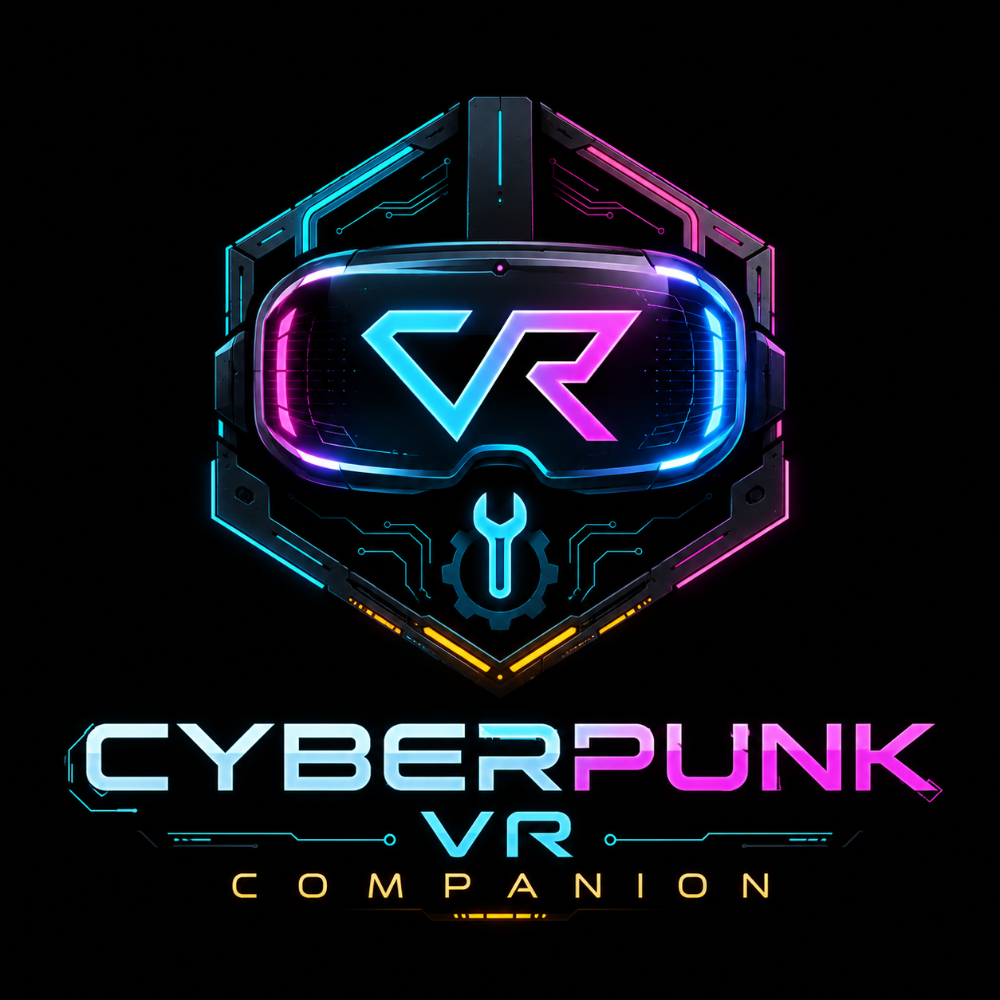
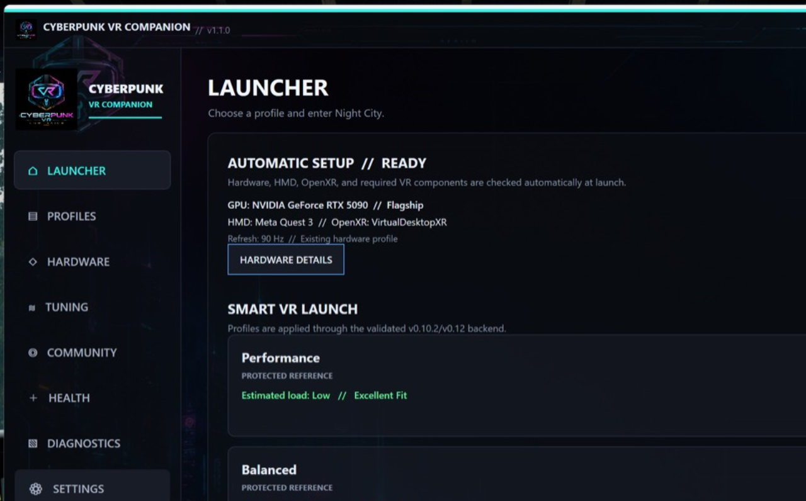
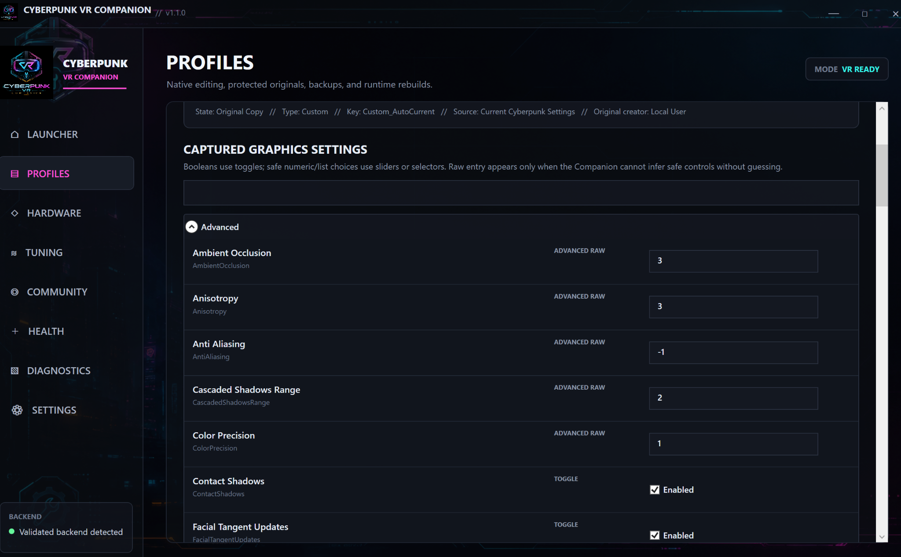

# Cyberpunk VR Companion

**Cyberpunk VR Companion** is a Windows companion application built to simplify launching, configuring, troubleshooting, and tuning a Cyberpunk 2077 VR setup.

> **Unofficial community utility:** Cyberpunk VR Companion is not affiliated with, approved by, endorsed by, or sponsored by CD PROJEKT RED.

[Installation](INSTALLATION.md) · [User Guide](USER_GUIDE.md) · [Troubleshooting](TROUBLESHOOTING.md) · [Support](SUPPORT.md) · [Contributing](CONTRIBUTING.md) · [License](LICENSE.md)

## What it does

- Automatically detects the Cyberpunk 2077 installation.
- Automatically detects GPU, headset, and active OpenXR runtime.
- Creates a protected **Current Settings (Auto-Detected)** baseline from the user's existing Cyberpunk graphics configuration.
- Creates protected public reference profiles for **Performance**, **Balanced**, **Ray Tracing**, and **Clarity**.
- Provides friendly profile controls with sliders, toggles, and selectors where the setting can be represented safely.
- Includes Smart VR Launch with automatic launch-readiness repair.
- Supports VR / flatscreen mode switching without disturbing the rest of the mod stack.
- Includes hardware compatibility analysis and Assisted Tuning.
- Includes Health Check and privacy-sanitized Diagnostic Pack tools.
- Includes community profile import/export support.
- Uses a true OpenXR/D3D11 stereo startup presentation when an HMD is available, with desktop fallback when it is not.
- Includes normal uninstall and full-reset tools.

## One-click install

Normal users should download only:

`CyberpunkVRCompanionSetup.exe`

Then:

1. Close Cyberpunk 2077 and Cyberpunk VR Companion if either is running.
2. Run `CyberpunkVRCompanionSetup.exe`.
3. Approve the Windows elevation prompt if requested.
4. Setup detects the Cyberpunk installation, installs the Companion, creates shortcuts, and launches it.
5. On first launch, Automatic Setup detects hardware/HMD/OpenXR and creates the local graphics baseline and reference profiles.

## Requirements

Cyberpunk VR Companion does **not** bundle Cyberpunk 2077 or third-party VR/mod frameworks. Users are responsible for compatible versions required by their VR setup.

Typical environment:

- Windows 10/11 x64
- Cyberpunk 2077
- Cyber Engine Tweaks
- RED4ext
- Compatible Cyberpunk VR port
- Working PCVR/OpenXR runtime

The Companion detects required components and reports missing items under **Automatic Setup** and **Health**.

## Tested VR port

Cyberpunk VR Companion v1.1.0 was developed and validated primarily with the **iPowerTech CyberpunkVR Port**:

**[iPowerTech/cyberpunk-vr-port](https://github.com/iPowerTech/cyberpunk-vr-port)**

That repository is a fork of the upstream **[dariulone/cyberpunk-vr-port](https://github.com/dariulone/cyberpunk-vr-port)** project.

The VR port is a separate third-party project and is **not bundled with Cyberpunk VR Companion**. Follow the VR port project's current installation instructions and dependency requirements first, verify that Cyberpunk launches correctly in VR, and then install/use the Companion.

Other compatible Cyberpunk VR configurations may work, but the iPowerTech port represents the primary environment used to validate Companion v1.1.0.

## Uninstall / Full Reset

Cyberpunk VR Companion includes two removal options:

- **Normal uninstall** — removes the Companion while preserving the intended user data/state.
- **FULL RESET** — removes Companion-managed state for a completely fresh Companion setup.

Neither option removes Cyberpunk 2077, Cyber Engine Tweaks, RED4ext, the VR port, Virtual Desktop, or the user's OpenXR runtime.

Use **FULL RESET** only when you intentionally want to return the Companion itself to a fresh-install state.

## VR / Flatscreen mode switcher

Some parts of Cyberpunk 2077 can be difficult or impossible to complete correctly while a VR port is active. This can happen when a scene depends on gaze direction, 2D UI interaction, camera behavior, scripted positioning, or another mechanic that does not translate cleanly into VR.

The **VR / Flatscreen switcher** exists as a safe recovery path for those situations.

### Recommended workflow

1. **Save your game** before the affected scene or mission step.
2. **Fully exit Cyberpunk 2077.**
3. In Cyberpunk VR Companion, switch the game to **Flatscreen** mode.
4. Launch Cyberpunk normally through the Companion.
5. Complete the scene, interaction, or mission step that was blocking progress.
6. **Save again and fully exit the game.**
7. Switch the Companion back to **VR** mode.
8. Relaunch and continue playing in VR.

Do **not** switch between VR and Flatscreen while Cyberpunk is still running.

The switcher is intended to let users temporarily bypass VR-specific progression issues without manually removing/reinstalling the VR port or disturbing the rest of the mod setup.

## Profiles

First launch creates:

- **Current Settings (Auto-Detected)** — protected snapshot of the user's current Cyberpunk graphics configuration.
- **Performance**
- **Balanced**
- **Ray Tracing**
- **Clarity**

Protected profiles are never edited directly. Duplicate one to create an editable Custom profile.

## Safety philosophy

The Companion avoids guessing when it cannot safely infer a setting. Known settings receive friendly controls; unknown/new settings can fall back to **Advanced Raw** rather than silently changing unsupported values.

## User guide

For a practical explanation of every major Companion feature, including profiles, Assisted Tuning, VR/Flatscreen recovery, Health, Diagnostics, Community profiles, and first-time workflow, see the **[User Guide](USER_GUIDE.md)**.

## Feedback and feature requests

Cyberpunk VR Companion is intended to improve through user feedback.

- Use a **Bug Report** when something that should work is reproducibly broken.
- Use a **Feature Request** for a concrete improvement you would like considered.
- Use **GitHub Discussions** for questions, profile/settings discussion, brainstorming, and early ideas.

See [CONTRIBUTING.md](CONTRIBUTING.md) for the community workflow.

## Troubleshooting

Start with **Health**. If more detail is needed, use **Diagnostics → Create Diagnostic Pack**.

See [TROUBLESHOOTING.md](TROUBLESHOOTING.md).

## Privacy

See [PRIVACY.md](PRIVACY.md).

## License

Cyberpunk VR Companion is distributed under the **[Cyberpunk VR Companion Proprietary License](LICENSE.md)**.

Official, unmodified compiled releases may be downloaded and used at no charge. Reviews, tutorials, demonstrations, livestreams, screenshots, articles, and other coverage are permitted, including monetized media content. Repackaging, resale, mirroring, modified redistribution, or bundling of the Software is not permitted without prior written permission.

The full application source is not part of the current public release. See [SOURCE_AVAILABILITY.md](SOURCE_AVAILABILITY.md).

## Release

Current public release: **v1.1.0**

See [RELEASE_NOTES_v1.1.0.md](RELEASE_NOTES_v1.1.0.md) and [CHANGELOG.md](CHANGELOG.md).

## Disclaimer

Cyberpunk VR Companion is an independent community utility and is not affiliated with, endorsed by, or sponsored by CD PROJEKT RED, Meta, Virtual Desktop, Valve, iPowerTech, dariulone, or the maintainers of third-party VR/mod frameworks. Product and company names are trademarks of their respective owners.
